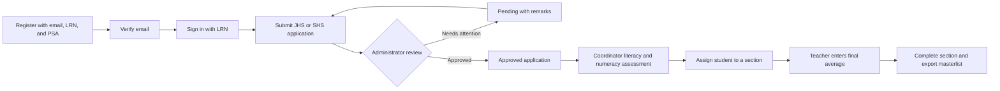

<div align="center">

# TuloyEskwela PDBNHS

### Enrollment Management System

A role-based web platform for digitizing student registration, enrollment review, assessment, section assignment, and class-list management for Paso de Blas National High School.

<p>
  
  
  
  
</p>

<p>
  <a href="#features">Features</a> |
  <a href="#user-roles">User roles</a> |
  <a href="#getting-started">Getting started</a> |
  <a href="#architecture">Architecture</a> |
  <a href="#configuration">Configuration</a>
</p>

</div>

> [!NOTE]
> This README describes the current implementation in this repository. The application is configured for MySQL through environment variables and uses SMTP for account and enrollment notifications.

## Overview

TuloyEskwela PDBNHS brings the school enrollment workflow into one application:

1. Applicants create an account using their email address, Learner Reference Number (LRN), and PSA number.
2. Applicants verify their email, sign in with their LRN, and submit a Junior High School (JHS) or Senior High School (SHS) enrollment form.
3. Administrators review applications, request corrections when needed, approve qualified applicants, and manage school information.
4. Coordinators record literacy and numeracy assessment results, organize students by grade and academic year, and assign sections.
5. Teachers manage their assigned class list, enter final averages, mark sections complete, and export Excel masterlists.

The public-facing site also presents announcements, FAQs, contact information, organizational chart data, and enrollment availability notices.

## Features

### Applicant and student experience

- Account registration with duplicate email, LRN, and PSA number checks.
- Email verification before an applicant can log in.
- LRN and password authentication for applicants and students.
- Separate JHS and SHS enrollment paths for Grades 7 to 12.
- Early registration and regular enrollment windows controlled by administrators.
- Application forms for new, returning, and transferee students.
- SHS semester, track, strand, science average, and mathematics average fields.
- Learner information, addresses, parent or guardian details, learning modality, 4Ps, IP community, disability, and document information.
- Server-side validation for age, birth date, academic averages, required transferee data, and terms acceptance.
- Application number generation and email notification after submission.
- Role-aware profile and enrollment pages.

### Administrator workspace

- Dashboard with application and user statistics.
- Date filters for today, month, year, or all records.
- Application review with in-review, approved, and pending states.
- Single and bulk approval or re-approval actions.
- Pending reasons and submission remarks.
- Student, applicant, administrator, coordinator, and teacher account management.
- Account deactivation and password changes.
- Enrollment period and school-year management.
- Announcement, FAQ, and organizational chart management.
- Reports with interactive application, user, gender, grade, enrollment type, student type, strand, registration, and document analytics.
- Excel report export and chart image export.

### Coordinator workspace

- Literacy and numeracy assessment management for approved applications.
- Individual assessment updates and bulk completion actions.
- Grade-level views for Grades 7 to 12 across academic years.
- Section creation, editing, deletion, teacher assignment, capacity, and status management.
- Lists of assigned and unassigned students.
- Automatic student-to-section assignment.
- Student status updates for enrolled, transferred, and dropped learners.

### Teacher workspace

- Class list for the teacher's assigned section and current school year.
- Student search and gender filtering.
- Student detail inspection.
- Final average entry.
- Section completion workflow.
- Excel masterlist generation from the provided workbook template.

## User roles

| Role          | Main responsibility                                                                       | Default workspace              |
| ------------- | ----------------------------------------------------------------------------------------- | ------------------------------ |
| Applicant     | Register, verify email, submit an enrollment application, and view profile information.   | `/enrollment/`                 |
| Student       | View student information and participate in the continuing enrollment workflow.           | `/profile/` and `/enrollment/` |
| Administrator | Manage the enrollment process, users, applications, school content, and reports.          | `/admin/dashboard/`            |
| Coordinator   | Complete assessments, organize sections, assign students, and manage academic-year lists. | `/coordinator/assessment/`     |
| Teacher       | Manage the assigned class list, final averages, completion status, and masterlists.       | `/teacher/student_list/`       |

## Enrollment lifecycle



## Technology stack

### Backend

- Python 3.13
- Django 5.2.6
- Django ORM and migrations
- Custom email-based user model (`authentication.MyUser`)
- `django-environ` for environment configuration
- `mysqlclient` for the MySQL database driver
- WhiteNoise for static-file serving
- SMTP email backend for verification and enrollment notifications

### Frontend and supporting tools

- Django templates
- HTML, CSS, and JavaScript
- Bootstrap-based responsive layouts
- jQuery DataTables for server-side tables
- ECharts for report visualizations
- SweetAlert2 for confirmations and feedback
- TinyMCE for rich-text content editing
- Pillow for image handling
- OpenPyXL for Excel exports

## Architecture

The project is organized as a Django project with focused application modules:

```text
Enrollment-Management-System/
├── adminside/                 Administrator dashboard, workflows, services, repositories
├── authentication/            Custom user model, registration, login, verification
├── coordinator/               Assessments, sections, academic-year student assignment
├── teacher/                   Class lists, final averages, completion, Excel exports
├── landingpage/               Public pages, enrollment forms, enrollment domain models
├── enrollmentwebsite/         Django settings, root URLs, WSGI, ASGI, static assets
├── templates/                 Public, authentication, administrator, coordinator, teacher UI
├── static/                    Shared Excel files, images, and vendor assets
├── manage.py                  Django management entry point
├── requirements.txt           Pinned Python dependencies
└── package.json               Frontend dependency metadata
```

The application uses repository and service classes in `adminside/repositories/` and `adminside/services/` for data access and reusable business operations. Many workspace tables use server-side JSON endpoints to keep large lists responsive.

### Important domain entities

- `MyUser`: custom user account identified by email, with role, verification, activation, and deactivation state.
- `ApplicantInformation`: initial learner identity linked to an applicant account.
- `EnrollmentForm`: submitted JHS or SHS application and supporting learner, family, address, and inclusion data.
- `ApplicationApproved`: approved application record.
- `ApplicationPending`: application requiring attention, including a pending message.
- `Assessment`: literacy and numeracy assessment attached to an approved application.
- `StudentInformation`: learner record created for the student workflow.
- `Section`: grade-level section with academic year, teacher, capacity, and status.
- `StudentListHistory`: student-to-section placement history used by coordinator and teacher lists.
- `Announcement`, `FAQ`, `OrganizationChart`, and `EnrollmentManagement`: public content and enrollment-period configuration.

## Main routes

| Area                 | URL prefix         | Purpose                                                                                                   |
| -------------------- | ------------------ | --------------------------------------------------------------------------------------------------------- |
| Public site          | `/`                | Home, about, announcements, FAQs, contact, and enrollment information                                     |
| Authentication       | `/authentication/` | Registration, LRN login, staff sign-in, logout, and email verification                                    |
| Applicant enrollment | `/enrollment/`     | Enrollment overview, JHS form, SHS form, and enrollment settings API                                      |
| Administrator        | `/admin/`          | Dashboard, applications, reports, users, announcements, FAQs, organization chart, and enrollment settings |
| Coordinator          | `/coordinator/`    | Assessments, grade levels, section management, and student placement                                      |
| Teacher              | `/teacher/`        | Assigned class list, final averages, completion, and Excel exports                                        |
| Django admin         | `/super_admin/`    | Django's built-in administrative site                                                                     |

## Getting started

### Prerequisites

Install the following before setup:

- Python 3.13
- MySQL Server 8 or a compatible MySQL installation
- Node.js and npm, if frontend package scripts or dependency management are needed
- A configured SMTP account for verification and notification emails

### 1. Clone the repository

```bash
git clone <your-repository-url>
cd Enrollment-Management-System
```

### 2. Create and activate a virtual environment

Windows PowerShell:

```powershell
py -3.13 -m venv venv
.\venv\Scripts\Activate.ps1
```

macOS or Linux:

```bash
python3.13 -m venv venv
source venv/bin/activate
```

### 3. Install dependencies

```bash
python -m pip install --upgrade pip
pip install -r requirements.txt
```

The repository also declares `sweetalert2` in `package.json`:

```bash
npm install
```

### 4. Create the MySQL database

Create an empty database and a user with permission to access it. The active Django settings use port `3306`.

```sql
CREATE DATABASE enrollment_management CHARACTER SET utf8mb4 COLLATE utf8mb4_unicode_ci;
CREATE USER 'enrollment_user'@'localhost' IDENTIFIED BY 'change-this-password';
GRANT ALL PRIVILEGES ON enrollment_management.* TO 'enrollment_user'@'localhost';
FLUSH PRIVILEGES;
```

### 5. Configure environment variables

Create a `.env` file in the project root. Do not commit real credentials.

```dotenv
SECRET_KEY=replace-with-a-long-random-secret-key
DEBUG=True

DB_NAME=enrollment_management
DB_USER=enrollment_user
DB_PASSWORD=change-this-password
DB_HOST=127.0.0.1

EMAIL_HOST=smtp.example.com
EMAIL_PORT=587
EMAIL_USE_TLS=True
EMAIL_HOST_USER=notifications@example.com
EMAIL_HOST_PASSWORD=replace-with-an-app-password
```

`enrollmentwebsite/settings.py` reads these values using `django-environ`. Database and email settings are required by the current configuration.

### 6. Apply migrations

```bash
python manage.py migrate
```

### 7. Create an administrator account

```bash
python manage.py createsuperuser
```

The custom user manager assigns the `Administrator` role to users created through `createsuperuser`.

### 8. Start the development server

```bash
python manage.py runserver
```

Open <http://127.0.0.1:8000/> in a browser.

## Configuration

The main configuration lives in `enrollmentwebsite/settings.py`:

- `AUTH_USER_MODEL` is set to `authentication.MyUser`.
- `AUTHENTICATION_BACKENDS` supports LRN authentication and Django's model backend.
- The application timezone is `Asia/Manila`.
- Static files are served through WhiteNoise in supported deployments.
- Media files are served from the configured `MEDIA_ROOT` during development.
- Sessions expire after 24 hours and are configured not to expire when the browser closes.
- Passwords must satisfy Django's validators plus the custom upper/lowercase/symbol validator.

For production, set `DEBUG=False`, use a strong secret key, configure the correct `ALLOWED_HOSTS` and CSRF trusted origins, protect SMTP and database credentials, run `collectstatic`, and deploy behind HTTPS.

## Validation rules worth knowing

- LRN values must contain exactly 12 digits.
- Email, LRN, and PSA values are checked for duplicates during registration.
- Password confirmation is required and passwords use Django validation rules.
- General averages must be between 75 and 100.
- SHS science and mathematics averages must meet the form's configured range.
- Age must satisfy the selected grade-level minimum and match the birth date.
- Returning and transferee applicants must provide previous school information.
- Applicants must accept the enrollment terms before submission.

## Testing and maintenance

Run Django's built-in checks and test suite from the project root:

```bash
python manage.py check
python manage.py test
```

Useful maintenance commands:

```bash
python manage.py makemigrations
python manage.py migrate
python manage.py collectstatic
```

The repository includes app-level test modules under `authentication/`, `landingpage/`, `adminside/`, `coordinator/`, and `teacher/`. Tests that access the database require a working test database configuration.

## Security notes

- Keep `.env` files and SMTP credentials out of version control.
- Never use `DEBUG=True` in production.
- Replace development secrets and review `ALLOWED_HOSTS` before deployment.
- Use HTTPS for login, email verification, and enrollment submission.
- Review uploaded media and document handling before exposing the system publicly.
- Restrict MySQL permissions to the application database.

## Contributing

1. Create a focused branch for your change.
2. Keep business logic in the owning Django app or its existing service/repository layer.
3. Add or update tests for behavior changes.
4. Run `python manage.py check` and `python manage.py test` before opening a pull request.
5. Document new environment variables, routes, or setup requirements.

## License

No repository license is currently declared. Add a license file and update this section before publishing the project for reuse.

<div align="center">

Built for a more organized, transparent, and accessible school enrollment workflow.

</div>
